# Benchmarker

The files of `bench/visual/` time the same work in each library with the
[Benchmarker](https://devforum.roblox.com/t/benchmarker-plugin-compare-function-speeds-with-graphs-percentiles-and-more/829912)
plugin in Roblox Studio: jecs 0.11.0 and mErCS in every file, and ecr 0.9.0 in the four
basic benchmarks that jecs ships with (spawn, despawn, insertion, query). The place of
`benchmarker.project.json` holds the libraries (the Wally dev packages and `src/`) and these
files; [Development](../development/README.md#benchmarker-roblox-studio) explains how to open
it.

Compare the medians (the 50th percentile): Benchmarker's "Average" is the midpoint of the
minimum and the maximum. The numbers of the CLI, measured in isolated processes, are on the
pages of [jecs](jecs.md#performance), [ecr](ecr.md#performance) and
[1.0.1 and 1.0.0](previous-release.md).

| File | What | Libraries |
|---|---|---|
| `spawn.bench.luau` | 1000 entities with 4 components | jecs, mErCS, ecr |
| `despawn.bench.luau` | delete 1000 entities with 4 components and a tag | jecs, mErCS, ecr |
| `insertion.bench.luau` | 8 components into 500 existing entities | jecs, mErCS, ecr |
| `query.bench.luau` | 10 passes of a 4-component query over 4096 entities: for-in, `query:each` for mErCS, a view for ecr | jecs, mErCS, ecr |
| `batch.bench.luau` | add and remove a tag on 1000 of 2000 entities: batch operations against a jecs collect-and-change loop | jecs, mErCS |
| `pairs.bench.luau` | 100 parents with 10 `ChildOf` children that also target a parent through a relation, then the parents are deleted | jecs, mErCS |
| `query_churn.bench.luau` | a query case: a tag of the query toggled on 1 or 100 entities before each pass | jecs, mErCS |
| `query_empty.bench.luau` | a query case: 100 passes of a query that never matches | jecs, mErCS |
| `query_read4.bench.luau` | a query case: 4 values read per match (80 000 entities) | jecs, mErCS |
| `query_scattered.bench.luau` | a query case: a 4-component query over 50 000 entities scattered by churn | jecs, mErCS |
| `query_wildcard.bench.luau` | a query case: `(*, T)` with a pair toggled before each pass | jecs, mErCS |
| `remove.bench.luau` | remove one of 5 components from 1000 entities | jecs, mErCS |

## Screenshots

Benchmarker v7.3.1, Edit mode, native code, 1000 calls of each function, with jecs 0.11.0,
mErCS 1.0.0 and, in the four basic benchmarks, ecr 0.9.0. They were captured with 1.0.0 and not
again for 1.0.1, whose numbers come from the CLI (the pages of jecs, ecr and the previous
release). Roblox compiles a script to native
code only when it has the `--!native` comment: the modules of jecs and mErCS have it, the module
of ecr does not, so ecr runs as bytecode here. The CLI numbers of [ecr](ecr.md#performance)
compile all three to native code (`--codegen`) and also give the interpreter.

The medians (the 50th percentile) of the screenshots below, per call:

| Benchmark | jecs 0.11.0 | mErCS 1.0.0 | ecr 0.9.0 |
|---|---|---|---|
| spawn | 845 µs | 532 µs | 947 µs |
| despawn | 415 µs | 312 µs | 934 µs |
| insertion | 917 µs | 628 µs | 798 µs |
| query | 0.110 ms | 0.130 ms; `query:each` 0.057 ms | 1.950 ms |
| batch | 485 µs | 53 µs | — |
| pairs | 7.636 ms | 1.891 ms | — |
| query_churn, toggle 1 | 155 µs | 154 µs | — |
| query_churn, toggle 100 | 247 µs | 227 µs | — |
| query_empty | 6 µs | 2 µs | — |
| query_read4 | 1.613 ms | 0.815 ms | — |
| query_scattered | 125 µs | 76 µs | — |
| query_wildcard | 799 µs | 344 µs | — |
| remove | 333 µs | 65 µs | — |

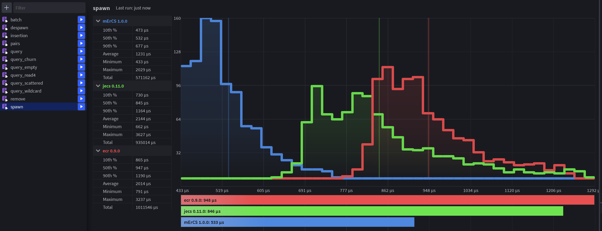

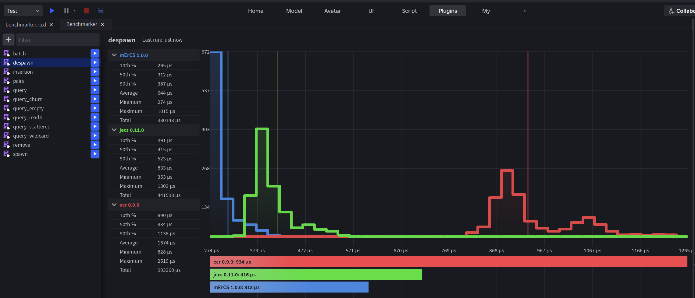

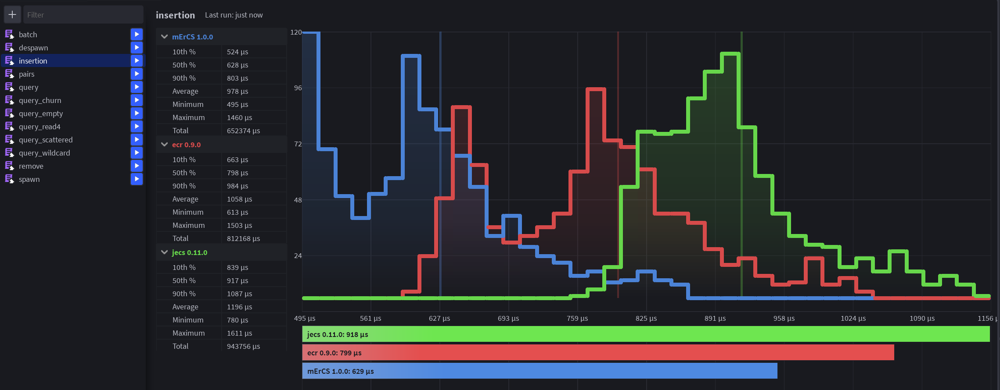

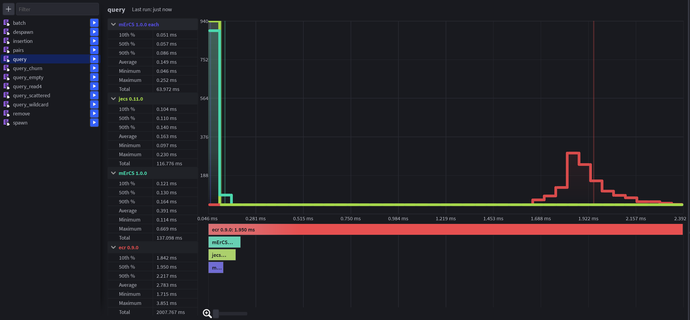

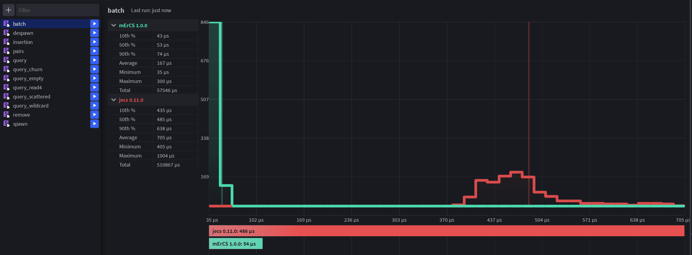

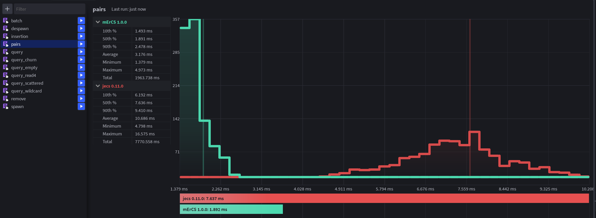

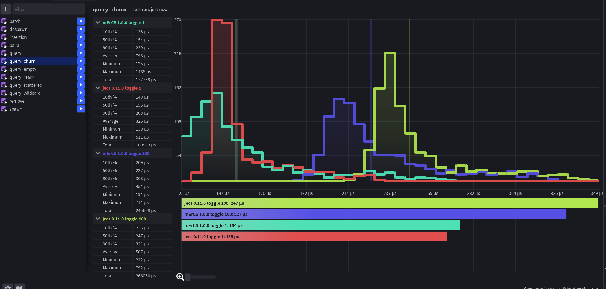

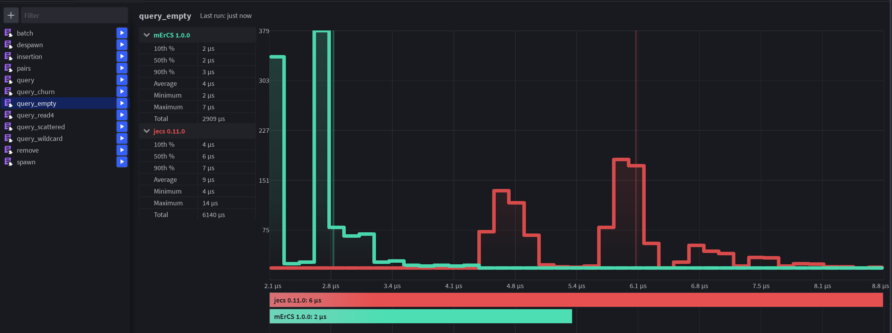

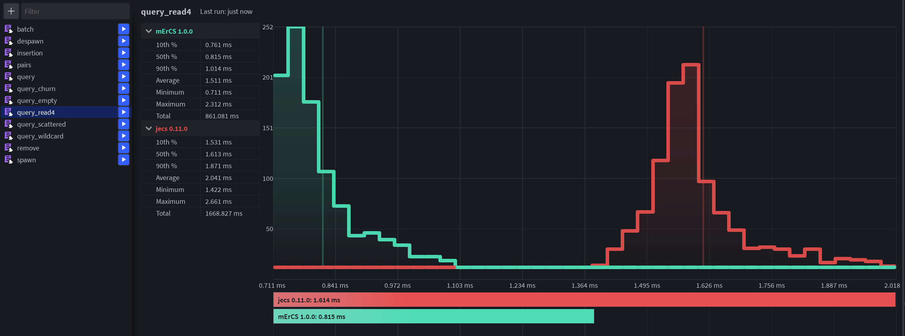

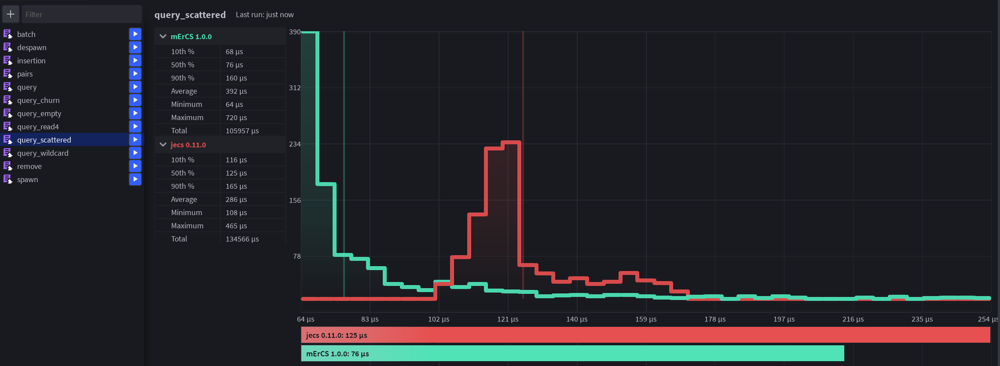

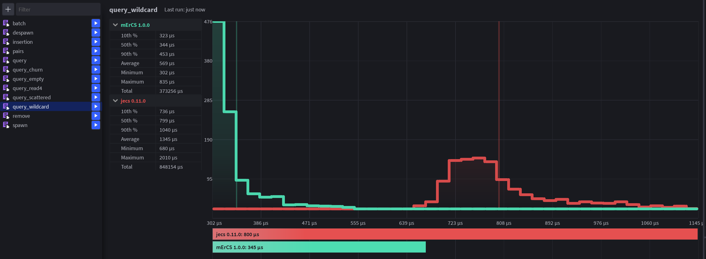

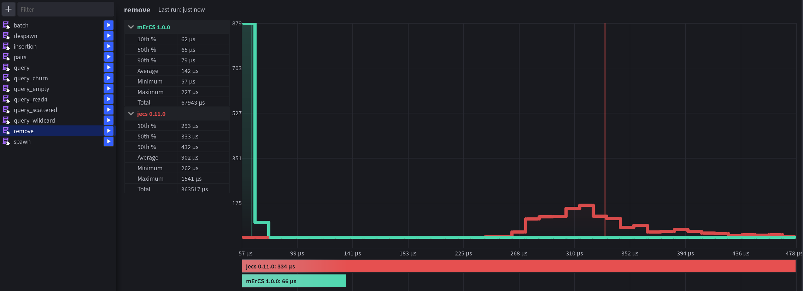
