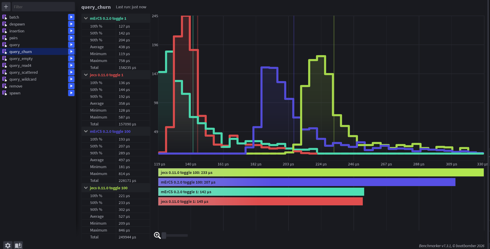
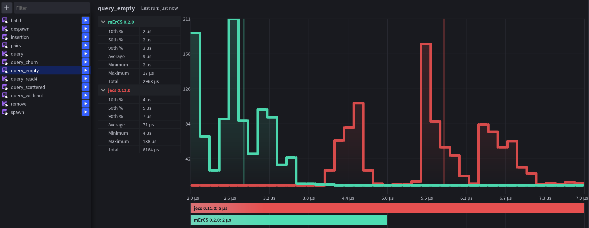
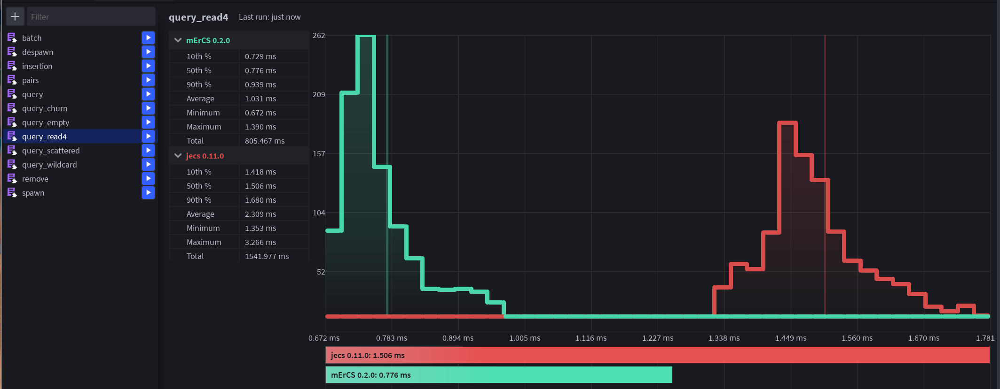
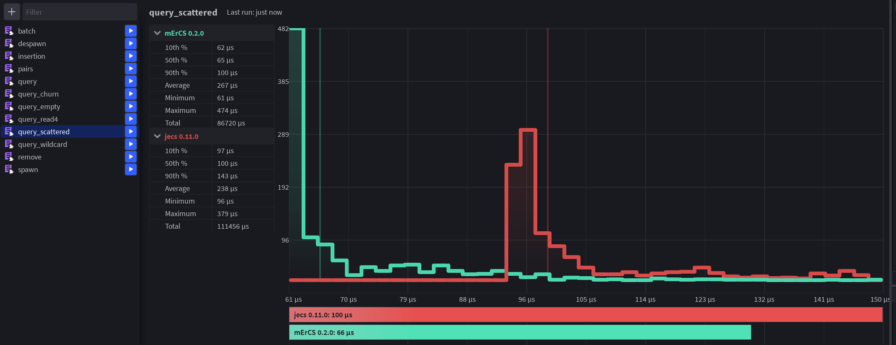
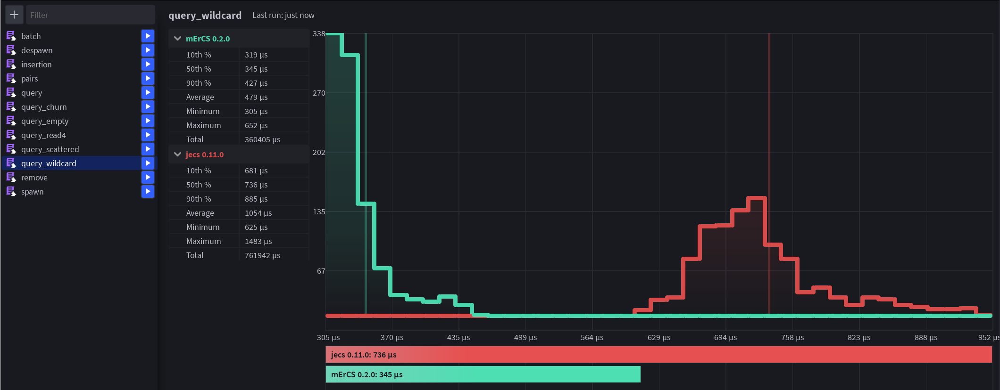

# mErCS and jecs

How mErCS 0.2.4 differs from [jecs](https://github.com/Ukendio/jecs) 0.11.0: the design,
the behaviour, when jecs is the better choice, the numbers (with mErCS 0.2.3, the previous
release, beside them), and how to move code over.

## Contents

- [Design](#design)
- [Compatibility](#compatibility)
- [Differences in behaviour](#differences-in-behaviour)
- [Beyond jecs](#beyond-jecs)
- [When jecs is the better choice](#when-jecs-is-the-better-choice)
- [Performance](#performance)
- [Migrating from jecs](#migrating-from-jecs)

## Design

An archetype ECS (jecs, flecs) stores the entities with the same set of components together.
That makes iteration fast, but every add or remove moves the entity to another archetype and
copies all its columns, every new combination of components creates an archetype that lives
until someone cleans it up, and relationships to many targets create an archetype per target.

mErCS keeps, for every component, tag or pair, a bitset of the entities that have it,
and the values in pages indexed by the entity slot (the model of the C# library
[StaticEcs](https://github.com/Felid-Force-Studios/StaticEcs), adapted to Luau). A query ANDs
the bitsets 32 entities at a time and walks the set bits.

| | jecs 0.11.0 | mErCS 0.2.4 |
|---|---|---|
| add / remove a component | moves the entity, copies all its columns: O(components) | sets a bit and a value: O(1) |
| new combination of components | creates an archetype (kept until `world:cleanup()`) | nothing to create |
| pair with many targets | an archetype per target | one small record per pair, freed when unused (in batches) or with its target |
| components per world | 256 via `world:component()` | no limit |
| ids per `get` / `has` call | 4 | 8, any number with `get_list` / `has_all` |
| memory per entity with 4 components | 320 B | 131 B |
| deep hierarchies | the cascade recurses: stack overflow at about 6000 levels | any depth (past 100 levels the rest is queued) |

## Compatibility

The API follows jecs: worlds, entities, components, tags, pairs, wildcards, `Exclusive`,
cleanup policies, hooks, signals, `Name`, pre-registration (`jecs.component()` /
`jecs.tag()` / `jecs.meta()`), the `ECS_*` helpers and the builtin ids.

The 0.2.4 CLI check passes the jecs test suite (`test/jecs_compat/`) in both modes:
125 of 125 applicable cases pass (its `bulk_insert` / `bulk_remove` come from a test shim, as loops of `set` /
`remove`). The cases that inspect jecs internals (archetype records, edges, the entity
visualiser) are not applicable and are listed in `test/jecs_compat/README.md`.

## Differences in behaviour

- No archetypes: `world:cleanup()`, `query:fini()` and the ids `ArchetypeCreate` /
  `ArchetypeDelete` do not exist (there is nothing for them to do), hooks do not get an
  `oldarchetype` argument.
- The jecs helpers `World.new`, `w`, `bulk_insert` / `bulk_remove`, `new` / `new_w_id` /
  `new_low_id`, `query:iter()` and `is_tag` are not provided: they would only repeat native
  calls (see [Migrating from jecs](#migrating-from-jecs)).
- jecs internals (`query:archetypes()`, `world.entity_index`, `entity_index_try_get`) are
  not provided either; the [jabby adapter](../guide/README.md#introspection-and-jabby) gives the debugger what it reads.
- An uncached query can be iterated again (jecs drains it after the first loop).
- `get` / `has` take up to 8 ids positionally (jecs: 4).
- The iteration order is ascending by entity slot, not by archetype.
- Builtin ids after `Name` have other numbers: `Exclusive` is 268 (jecs: 270), `Disabled`
  (not in jecs) 269, `Rest` 270 (jecs: 271).
- The jecs addon `modules/OB` reads archetypes and does not work here. Its monitors are
  `query:monitor()`, which returns the same `added` / `removed` / `disconnect` (the 42 monitor
  cases of the tests of the addon pass, `test/jecs_compat/ob.luau`), and its observers are
  signals with a check of the query (see the [guide](../guide/README.md#query-monitors)). A
  monitor of mErCS does not make an entity leave and enter a query with an exclusive relation
  and any target when the relation replaces a pair; it takes no term `(*, T)`.
- Setting a hook after connecting signals keeps the signals (in jecs the hook replaces them),
  and `world:get(id, ecs.OnAdd)` returns the hook, not the signal dispatcher.
- A signal listener that disconnects itself while it runs does not make the next listener
  miss the event (in jecs it does).
- Signals and change tracking take a component, a tag or a relation (for all its pairs); a
  pair raises an error (jecs does not support pairs there either).
- Changing the world during a loop: the current entity may be changed or deleted in both.
  jecs may visit an entity twice when others are removed from its archetype; here an entity
  deleted ahead of the loop may be returned once as a dead id with nil values.
- `query:cached()` on a query that has not been iterated yet prepares it (picks how it
  iterates and builds its match list), as jecs matches its archetypes there; on a shared query
  (`world:query(...)` without change filters) it does nothing else: such a query is cached
  already. A query shape is shared from its second request; the first request gets a state of
  its own, which becomes the shared one when it is used again (a second loop, a modifier,
  `cached()`).
- A wildcard returns the value of one pair of each entity: `(R, *)` the pair with the lowest
  target slot, `(*, T)` the pair with the lowest relation slot (jecs: the first such pair in
  the type of the archetype, which is sorted by id).
- `world:each` and `world:children` return the members of the id when the loop starts, in
  ascending slot order: an entity that gets the id during the loop is not visited, and one
  deleted before the loop reaches it is returned as a dead id (jecs walks the rows of its
  archetypes backwards).
- `world:exists(e)` is also true for a slot reserved by a slot pool and not handed out yet.
- `world:remove(e, ecs.pair(R, ecs.Wildcard))` removes every pair `(R, *)` of the entity, and
  `ecs.pair(ecs.Wildcard, T)` every pair with the target `T`; `add` and `set` raise an error for
  a wildcard pair. jecs forbids a wildcard pair in all three: `jecs.world(true)` raises an
  error, and a world without the check leaves the pairs in place and breaks the row of the
  entity in its archetype.

## Beyond jecs

- `query:each(fn)` — a callback per match; see the measured [query loops](#queries-per-entity-or-match).
- `query:any(...)` — OR terms.
- Batch operations: `query:count`, `add_all`, `set_all`, `remove_all`, `delete_all`, and
  `world:remove_all(id)`.
- Change tracking by ticks: `world:track`, `world:tick`, the `:added` / `:changed` /
  `:removed` filters.
- `ecs.Disabled`: entities hidden from queries without removing their components.
- Slot pools: `world:pool()` and `pool:entity()` keep a kind of entities created among many
  others (creatures among their skills) in slots of its own, so the bitsets and value pages of
  what only they have stay dense.
- `world:ids(e)`, a debug world (`ecs.world(true)`, which also checks the match lists of
  cached queries against their bitsets), `query:spans()` with `world:column(id)`.

## When jecs is the better choice

jecs keeps the entities of one set of ids together, in the rows of an archetype; mErCS keeps a
bitset per id and the values in pages indexed by the entity slot. Each layout has cases that
the other cannot match. The numbers compare jecs 0.11.0 and mErCS 0.2.4: the time or memory of
mErCS divided by that of jecs, "interpreter / native" (see [Performance](#performance)).

### What only jecs has

- roblox-ts: jecs has TypeScript declarations (`@rbxts/jecs`); mErCS is a Luau module only.
- An observer object: the observer of the addon `modules/OB` calls back for every add or value
  change of an id of a query on an entity that matches it. In mErCS a signal with
  `query:has` does that; the monitors of the addon are `query:monitor()`.
- Archetypes as an API: `query:archetypes()` with the columns of each archetype, the ids
  `ArchetypeCreate` / `ArchetypeDelete`, and the tools that read them (the entity visualiser
  of jecs, for one). mErCS gives the value pages of a query through `query:spans()` and
  `world:column(id)`.
- The original of the API: the documentation and examples of jecs, and the tools made for it,
  apply to it as they are. mErCS follows the API, runs the jecs test suite and adapts jabby,
  with the differences listed in [Differences in behaviour](#differences-in-behaviour).

### Where jecs has a layout advantage

These measurements expose costs of the layouts. A slot pool helps when entities of a kind
can be allocated together. Ratios are interpreter / native; memory medians agree across modes.

| Case | jecs | mErCS | mErCS / jecs |
|---|---|---|---|
| Cached queries over scattered entities, memory per query | 5803 B | 263 KiB | 46.38× |
| Sparse components: 8 on 1 entity in 64, memory per entity | 170 B | 661 B | 3.90× |
| Eight kinds created in turn, 3 values read | rows of each kind stay together | values follow slot layout | for-in 2.02× / 2.33×; `each` 1.57× / 1.55×; `each` with a pool 0.85× / 0.62× |
| Delete entities with 100 targets of a relation | remove one archetype row | clear the bit of each pair record | 2.13× / 1.53× |

### Where jecs is faster in mErCS 0.2.4

The cases below compare measured medians. Consult the ranges in the full report for small
differences; these ratios do not establish a statistically significant difference on their own.

- Two inline queries per new caster: 2.42× / 1.98×;
  memory retained per caster: 376 B
  in mErCS, 0 B in jecs.
  Four inline queries using an entity term followed by its deletion:
  2.97× / 2.77×.
- A cached query over scattered entities, built and passed once:
  2.52× / 1.44×.
- For-in over a sparse match (1%): 1.70× / 1.69×;
  `query:each` against the jecs for-in: 1.01× / 0.87×.
- For-in with `without`: 1.15× / 1.10×.
- Adding the first component: 1.47× / 1.30×.
- Moving a child to another parent without a monitor:
  1.42× / 1.23×.
- In the sparse world without a slot pool, `Run` toggled before a pass:
  1.21× / 1.09×; a tag added and removed around passes:
  1.75× / 1.22×.

Other interpreter costs, including multi-id access, entity deletion and query monitors,
are listed in the operation tables. Queries with a reused shape avoid the cost of a new
entity term: a concrete pair per call is 0.70× / 0.69×,
and `query(A, pair(ChildOf, parent))` per parent is
0.60× / 0.60×.

### When to choose jecs

- A roblox-ts project.
- Code built on `query:archetypes()` or on tools that read archetypes.
- Dozens of cached queries over entities whose composition rarely changes, with a tight memory
  budget: the query caches of jecs stay small whatever the number of entities.
- Many kinds of entities created together (a creature with its skills and items) when a slot
  pool per kind does not fit the code, and the systems loop with for-in.
- Components on a small share of the entities of a very large world, when memory matters more
  than the cost of adding and removing them.
- Queries built on every call with new entities as terms (a query per new entity), when they
  take a large part of the frame.

For the measured trade-offs in structural changes, relationships, long sessions and memory
per entity, see [Design](#design), [Beyond jecs](#beyond-jecs) and [Performance](#performance).

## Performance

Benchmarks in `bench/`, measured on 2026-10-01 with Luau 0.740: jecs 0.11.0 (the pinned
Wally dev package), mErCS 0.2.3 from its verified git tag, and the 0.2.4 candidate. All three
columns were measured again. Cells read "interpreter / native": `-O2` / `-O2 --codegen`.
Ratios are the median time of 0.2.4 divided by jecs; lower is better.

Each implementation runs in its own process, five times in each mode, with the order rotated.
The tables show medians of those five runs. A matrix run takes the minimum of three timed
repetitions and the median retained-memory delta after full GC. The synthetic-frame helper
runs three batches per query style and returns the frame median from the batch with the
lowest minimum frame time. Small differences between medians should be read with their ranges.

The [complete measurements](https://github.com/dubalda/mErCS/blob/main/bench/results/0.2.4-jecs.md)
include min–max ranges, hashes, commands and
[raw samples](https://github.com/dubalda/mErCS/blob/main/bench/results/0.2.4-jecs.json).
These general comparisons supplement the separate
[P1–P9 release acceptance](https://github.com/dubalda/mErCS/blob/main/bench/results/0.2.4.md):
that suite measures the reference workload, paired controls and regressions against 0.2.3.

In that reference workload, 0.2.4 reduces frame heap growth by 8.6–9.4% and retained snapshot
buffers from about 32 to 4 MiB, while full-frame time stays within measured noise. P9 is a
GC-checked net heap-growth proxy, not total allocator traffic. The snapshot semantics of
`world:each` and `world:children` stay the same as in 0.2.3.

[Roblox Studio: Benchmarker](#roblox-studio-benchmarker) contains historical 0.2.3 captures;
the new 0.2.4 measurements here are from the standalone CLI.

### A synthetic game frame

`bench/frame.luau`: 3000 units with 2 attachments each follow their parents, 60 projectiles
spawn and expire per frame, damage uses a one-frame tag, 5 % of the units switch AI state
tags; plain for-in loops, the same code for all three. The median frame time; the queries are
written inline in every frame, or created once and `:cached()` (the recommended jecs style):

| Mode / queries | jecs 0.11.0 | mErCS 0.2.3 | mErCS 0.2.4 | 0.2.4 / jecs |
|---|---|---|---|---|
| interpreter, inline queries | 7.42 ms | 2.82 ms | 2.69 ms | 0.36× |
| interpreter, cached queries | 6.74 ms | 2.9 ms | 2.95 ms | 0.44× |
| native, inline queries | 5.48 ms | 1.84 ms | 1.88 ms | 0.34× |
| native, cached queries | 5.05 ms | 2.21 ms | 1.86 ms | 0.37× |

### A long session

`bench/leak.luau`: 5 of 200 enemies die and respawn every frame, 10 % of 500 units retarget
a living enemy through a pair `(Targeting, enemy)` and switch a state tag. Each cell is the
median of five isolated runs: heap growth since the start, and time per frame in the preceding
1000-frame window (including checkpoint GC). Both execution modes are measured:

| Mode | Frame | jecs 0.11.0 | jecs 0.11.0 + cleanup every 600 frames | mErCS 0.2.3 | mErCS 0.2.4 |
|---|---|---|---|---|---|
| interpreter | 1000 | +3.57 MiB, 0.226 ms | +3.60 MiB, 0.236 ms | +0.33 MiB, 0.094 ms | +0.33 MiB, 0.095 ms |
| interpreter | 3000 | +8.98 MiB, 0.243 ms | +8.80 MiB, 0.249 ms | +0.32 MiB, 0.097 ms | +0.32 MiB, 0.096 ms |
| interpreter | 5000 | +15.38 MiB, 0.245 ms | +15.66 MiB, 0.251 ms | +0.32 MiB, 0.095 ms | +0.32 MiB, 0.096 ms |
| native | 1000 | +3.57 MiB, 0.204 ms | +3.60 MiB, 0.202 ms | +0.33 MiB, 0.062 ms | +0.33 MiB, 0.064 ms |
| native | 3000 | +8.98 MiB, 0.210 ms | +8.80 MiB, 0.214 ms | +0.32 MiB, 0.061 ms | +0.32 MiB, 0.062 ms |
| native | 5000 | +15.38 MiB, 0.214 ms | +15.66 MiB, 0.221 ms | +0.32 MiB, 0.062 ms | +0.32 MiB, 0.060 ms |

The jecs heap continues to grow in this 5000-frame session, including with cleanup every
600 frames. The mErCS heap remains near its warmed checkpoint values. This describes the
measured session; it is not a guarantee for every entity layout or duration.

### Query cases

Five cases where an archetype ECS is expected to be at its best (`bench/query_cases.luau`,
and the `query cases` group of `bench/run.luau`). jecs runs for-in loops over cached queries;
mErCS builds the same worlds and runs the same loops through `query:each`, which replaces a
for-in loop fully when it does not break early. Time of one pass:

| Case | jecs 0.11.0 | mErCS 0.2.3 | mErCS 0.2.4 | 0.2.4 / jecs |
|---|---|---|---|---|
| Scattered after recycling | 129 / 110 µs | 107 / 64.1 µs | 97.1 / 63.9 µs | 0.75× / 0.58× |
| Churn on a queried tag, 1 toggle per pass | 366 / 307 µs | 334 / 226 µs | 334 / 229 µs | 0.91× / 0.75× |
| Churn on a queried tag, 100 toggles per pass | 286 / 243 µs | 321 / 208 µs | 312 / 203 µs | 1.09× / 0.83× |
| Read 4 components | 2.01 / 1.5 ms | 1.42 ms / 741 µs | 1.43 ms / 716 µs | 0.71× / 0.48× |
| `(*, T)` with churn | 844 / 730 µs | 567 / 343 µs | 561 / 342 µs | 0.67× / 0.47× |
| Usually empty | 69.3 / 65.3 ns | 43 / 27.5 ns | 47 / 27.7 ns | 0.68× / 0.42× |

- Scattered after recycling: 50 000 entities with random subsets of 8 components, then
  100 000 deletes and respawns; a pass of a 4-component query (3125 matches).
- Churn on a queried tag: 70 000 entities with `Position`, every 7th with `Velocity`; the
  query of both without `Stunned`, `Stunned` toggled on 1 or 100 movers before each pass. The
  query re-checks the changed slots only; list edits and the cost of the toggles are both
  included in the measurements above.
- Read 4 components: 80 000 entities, the fourth component on half of them.
- `(*, T)` with churn: 20 000 entities with one of 64 pairs `(R, T)`; a pair toggled before
  each pass of `Health` and `(*, T)`. The query reads the values of `(*, T)` from a mirror
  (see [The strengths of jecs](#the-strengths-of-jecs)).
- Usually empty: 100 000 entities, each with `Stunned` or `Invulnerable`; the query of both.
  The query keeps an empty list, and a pass after which nothing changed costs a comparison.

`luau -O2 --codegen bench/query_cases.luau` runs the same cases with the test kit of jecs:
one run per case, first loops included.

### A sparse world

The shape of a game with many entities per creature (`bench/run.luau`, group `sparse world`):
700 creatures (200 alive, 500 dead), each created right before its 500 skills, 350 000
entities in all; a pass of each query of a frame after the changes the game makes. A
creature sits alone in its value page, so a query over creatures reads a word per creature;
in the "pool" columns the creatures come from a slot pool (`world:pool()`), which keeps them
together. Time of one pass:

| Pass | jecs 0.11.0 | mErCS 0.2.3 | mErCS 0.2.4 | 0.2.4 / jecs | mErCS 0.2.3, pool | mErCS 0.2.4, pool | pool / jecs |
|---|---|---|---|---|---|---|---|
| Alive creatures, nothing changed | 6.41 / 5.83 µs | 5.97 / 4.75 µs | 5.68 / 4.44 µs | 0.89× / 0.76× | 6.87 / 4.09 µs | 7.08 / 4.02 µs | 1.10× / 0.69× |
| Alive creatures, `Dead` added to one and removed | 7.52 / 6.62 µs | 7.72 / 5.88 µs | 7.77 / 5.35 µs | 1.03× / 0.81× | 7.57 / 4.43 µs | 7.33 / 4.41 µs | 0.97× / 0.67× |
| Running creatures, `Run` toggled on one | 4.04 / 3.28 µs | 5.18 / 3.84 µs | 4.9 / 3.57 µs | 1.21× / 1.09× | 3.14 / 1.87 µs | 2.91 / 1.86 µs | 0.72× / 0.57× |
| A tag added to one creature, a pass, removed, a pass | 1.28 / 1.18 µs | 2 / 1.42 µs | 2.25 / 1.43 µs | 1.75× / 1.22× | 1.68 / 1.04 µs | 1.69 / 1.08 µs | 1.32× / 0.92× |
| A tag nobody has | 69.9 / 64.9 ns | 48.8 / 35.2 ns | 47.3 / 34.7 ns | 0.68× / 0.53× | 45.1 / 30.9 ns | 44.3 / 30.9 ns | 0.63× / 0.48× |
| All with `Model` (creatures and corpses) | 23 / 21.4 µs | 20.6 / 16.3 µs | 19.7 / 14.8 µs | 0.86× / 0.69× | 15.9 / 9.05 µs | 16 / 8.9 µs | 0.69× / 0.42× |
| A skill changes state, 10 queries over skills in `Cast` | 151 / 123 µs | 129 / 79.7 µs | 117 / 79.5 µs | 0.78× / 0.65× | 121 / 75.1 µs | 115 / 71.9 µs | 0.76× / 0.59× |

Without a pool, a change of one creature before a pass (`Run` toggled, a tag added and
removed) costs a list edit: the creature is a group of its own in the match list of the query,
and the group is inserted or removed. jecs moves the creature to another archetype, and its
pass costs nothing more.

### State tags

The group `state tags` of `bench/run.luau` (`bench/shapes.luau`): 1200 skills in 5 state tags;
10, 200 or 800 of them move to the next state, then 5 queries written inline pass over the
skills of each state (`query:each` in mErCS, for-in in jecs). Time per frame:

| Frame of 1200 skills, 5 inline queries | jecs 0.11.0 | mErCS 0.2.3 | mErCS 0.2.4 | 0.2.4 / jecs |
|---|---|---|---|---|
| 10 skills change state | 55.7 / 48.9 µs | 41.3 / 25.1 µs | 40.5 / 24.4 µs | 0.73× / 0.50× |
| 200 skills change state | 175 / 145 µs | 184 / 99.6 µs | 177 / 100 µs | 1.01× / 0.69× |
| 800 skills change state | 546 / 474 µs | 405 / 228 µs | 392 / 231 µs | 0.72× / 0.49× |

### The strengths of jecs

Ten cases where an archetype ECS is at its best, in time or in memory (the group
`jecs strengths` of `bench/run.luau`, `bench/strengths.luau`). An archetype keeps the entities
of one set of ids together, a query caches the archetypes it matches, and a wildcard pair is
resolved per archetype, while a bitset ECS pays per entity, per changed slot or per value page.
Time of one pass or per unit; memory is what a unit keeps:

| # | Case | jecs 0.11.0 | mErCS 0.2.3 | mErCS 0.2.4 | 0.2.4 / jecs |
|---|---|---|---|---|---|
| 1 | `(*, T)` values, 32 data relations, a pass over 20 000 | 776 / 625 µs | 590 / 316 µs | 577 / 311 µs | 0.74× / 0.50× |
| 2 | `(R, *)` values, 8 targets, a pass over 20 000 | 778 / 627 µs | 589 / 314 µs | 555 / 317 µs | 0.71× / 0.51× |
| 3 | 15 cached queries over scattered entities, per query | 314 / 255 µs | 776 / 329 µs | 792 / 368 µs | 2.52× / 1.44× |
|  | the same, memory per query | 5803 B | 263 KiB | 263 KiB | 46.38× |
| 4 | usually empty, 20 swaps per pass (100 000 entities) | 16.8 / 15.9 µs | 13.7 / 7.61 µs | 14.3 / 7.73 µs | 0.85× / 0.49× |
|  | 5 queries, 100 matches each, 40 toggles per frame | 55.2 / 49.6 µs | 35.8 / 18.1 µs | 38.6 / 17.5 µs | 0.70× / 0.35× |
| 5 | 20 small queries, a shared tag toggled on 30 per frame | 24.9 / 17.8 µs | 22.8 / 14.8 µs | 22.2 / 15 µs | 0.89× / 0.84× |
| 6 | `query(A, pair(ChildOf, parent))` per parent (1000 × 5) | 979 / 860 ns | 586 / 485 ns | 587 / 520 ns | 0.60× / 0.60× |
|  | 2 inline queries per new caster | 2 / 1.81 µs | 4.63 / 3.84 µs | 4.83 / 3.57 µs | 2.42× / 1.98× |
|  | the same, memory per caster | 0 B | 376 B | 376 B | — |
| 7 | `world:each` over 100 000, per entity | 30 / 24.9 ns | 33.1 / 24.5 ns | 33 / 24.5 ns | 1.10× / 0.99× |
|  | `world:children`, 1000 children, per child | 29 / 24.9 ns | 38.1 / 25.5 ns | 32.9 / 25.5 ns | 1.13× / 1.02× |
| 8 | 8 kinds in turn, 3 values, for-in, per match | 43 / 33.1 ns | 86.8 / 87 ns | 86.7 / 77.2 ns | 2.02× / 2.33× |
|  | the same, `each` | 43 / 33.1 ns | 66 / 52.1 ns | 67.4 / 51.3 ns | 1.57× / 1.55× |
|  | the same, `each`, the kind from a slot pool | 43 / 33.1 ns | 36.9 / 20.8 ns | 36.5 / 20.7 ns | 0.85× / 0.62× |
| 9 | delete entities with 100 targets, per pair | 29.7 / 29.9 ns | 64 / 45.8 ns | 63.1 / 45.6 ns | 2.13× / 1.53× |
| 10 | 8 components on 1 entity in 64 of 131 072, memory per entity | 170 B | 660 B | 661 B | 3.90× |
|  | the same, time per entity | 2.81 / 2.26 µs | 2.61 / 1.69 µs | 2.74 / 1.81 µs | 0.97× / 0.80× |

1. `(*, T)` values. jecs reads the column of the first pair of `T` in each archetype. mErCS
   keeps a mirror for a wildcard whose values a query returns: value pages with the value of one
   pair of each entity (the lowest relation slot for `(*, T)`, the lowest target slot for
   `(R, *)`), updated by every change of its pairs; the query reads it like the column of a
   component. A mirror keeps about 17 B per member (a `(*, T)` mirror also notes the pair that
   gives the value of a slot with several pairs of `T`): the world of this case with its query
   takes 254 B per entity (jecs: 315 B).
2. `(R, *)` values: the same mirror; the world with its query takes 157 B per entity (jecs:
   312 B).
3. The memory of cached queries. A query of an archetype ECS keeps a list of archetypes; a
   cached query of mErCS over scattered matches keeps a list of its matches (the entity and its
   index in the value page), which keeps its loops fast over scattered matches. The arrays of
   the list have their exact size, and the first list of a query is built from the spans that
   the choice of its iteration mode found. A list of words or of one number per match would take
   less memory, but would change the iteration cost; those alternatives are not measured here.
4. Queries over two large terms after more than a few changes of a term: a query re-checks the
   noted slots while that costs less than a pass, up to half of the words of the smallest term,
   and drops at once a slot that an unchanged required term does not have.
5. Twenty small queries that share a changing tag: every query re-checks the changes of the tag
   (jecs moves the entity between archetypes once, at the change). The queries that saw the same
   versions of a record read its changes from the journal once, and each drops the slots that an
   unchanged required term does not have; a query whose smallest term has few words tests those
   words against the changed bits of each word, gathered once for all the queries, so that its
   cost does not grow with the number of changes.
6. Inline queries built per call. A query shape is shared from its second request: the first
   request gets a light state of its own and only marks the shape, so a query requested once (an
   entity used as a term) keeps no shared state. A query that is not cached and whose smallest
   term lies in at most 64 words gathers its matches in one loop over those words before the
   loop of the caller, instead of a call of the span generator per match. The queries with a
   pair of an entity target are shared by shape as well and go with the target; the queries of a
   new caster stay slower, as their shape is new on every call.
7. `world:each` and `world:children` collect the members of the id at the start of the loop into
   a buffer from the module pool: records with at most 64 word keys, including emptied
   words, use sorted non-empty keys; larger records use the levels of their bitsets. The pool
   retains at most 16 buffers and 4 MiB of charged array storage, plus table overhead. A buffer
   larger than the budget is collected and allocated again on its next use.
8. Entities of several kinds created in turn: a kind lies in one slot of eight, so its values
   sit in the hash parts of their pages and its queries keep match lists; jecs stores each kind
   in an archetype of its own. A slot pool (`world:pool()`) keeps a kind dense and makes it
   faster than jecs.
9. Deleting entities with many pairs of one relation: every pair record clears its bit (jecs
   removes the row of the entity from one archetype); the pairs of a relation are cleared in one
   inline loop.
10. Sparse components in a large world: a component on one entity in 64 keeps, per entity, a
    word of its bitset and a quarter of a value page of 256 slots, where jecs keeps a row of an
    archetype. This is the cost of the page layout that `world:column` exposes; adding the
    components is faster than in jecs.

### Query monitors

The group `query monitors` of `bench/run.luau` (`bench/monitors.luau`): jecs 0.11.0 with the
monitors of its addon `modules/OB` against `query:monitor()` of mErCS, 10 000 entities:

| Case | jecs 0.11.0 + OB | mErCS 0.2.3 | mErCS 0.2.4 | 0.2.4 / jecs |
|---|---|---|---|---|
| a tag of the query added and removed, per cycle (an entry and an exit) | 686 / 600 ns | 786 / 515 ns | 773 / 524 ns | 1.13× / 0.87× |
| members of the query deleted, per entity | 545 / 541 ns | 585 / 344 ns | 595 / 344 ns | 1.09× / 0.64× |
| children moved to another parent, `(ChildOf, *)` monitored, per move | 517 / 434 ns | 702 / 434 ns | 795 / 453 ns | 1.54× / 1.04× |

The monitor measurements include both the underlying changes and listener dispatch.
For comparison, a child moved without a monitor takes
411 / 256 ns in mErCS and
289 / 209 ns in jecs
(1.42× / 1.23×).

A separate probe deletes entities with four components, with and without one `OnRemove`
hook. The median additional cost is 173 / 88.3 ns in mErCS
and 5.64 / 15.4 ns in jecs. Each sample subtracts two minima
of nine batches, so small differences in this probe are sensitive to timing noise.

### Single operations

`bench/run.luau`, 131 072 entities. jecs has no `query:each`: its rows compare `each` with the
jecs for-in loop over the same world.

#### Entities

| Scenario | jecs 0.11.0 | mErCS 0.2.3 | mErCS 0.2.4 | 0.2.4 / jecs |
|---|---|---|---|---|
| create an entity | 194 / 163 ns | 40.4 / 28.5 ns | 41.5 / 28.4 ns | 0.21× / 0.17× |
| delete an entity with 4 components | 379 / 360 ns | 456 / 234 ns | 445 / 237 ns | 1.17× / 0.66× |

#### Components

| Scenario | jecs 0.11.0 | mErCS 0.2.3 | mErCS 0.2.4 | 0.2.4 / jecs |
|---|---|---|---|---|
| add a first component | 129 / 101 ns | 187 / 121 ns | 189 / 131 ns | 1.47× / 1.30× |
| set an existing component | 66.9 / 58.9 ns | 67.3 / 43.9 ns | 67.4 / 44 ns | 1.01× / 0.75× |
| remove a component | 184 / 161 ns | 116 / 58 ns | 117 / 57.9 ns | 0.64× / 0.36× |
| add when the entity has 5 | 368 / 303 ns | 132 / 73.9 ns | 136 / 72.9 ns | 0.37× / 0.24× |
| remove when the entity has 6 | 384 / 324 ns | 115 / 57.4 ns | 115 / 57.8 ns | 0.30× / 0.18× |
| add when the entity has 20 | 1.57 / 1.24 µs | 136 / 71.9 ns | 133 / 73.5 ns | 0.08× / 0.06× |
| remove when the entity has 21 | 1.69 / 1.4 µs | 114 / 57.3 ns | 114 / 57.8 ns | 0.07× / 0.04× |
| add when the entity has 40 | 2.96 / 2.6 µs | 132 / 69.9 ns | 127 / 70.4 ns | 0.04× / 0.03× |
| remove when the entity has 41 | 3 / 2.58 µs | 115 / 57.1 ns | 114 / 57.8 ns | 0.04× / 0.02× |

#### Tags

| Scenario | jecs 0.11.0 | mErCS 0.2.3 | mErCS 0.2.4 | 0.2.4 / jecs |
|---|---|---|---|---|
| add a tag | 389 / 288 ns | 98 / 59.4 ns | 101 / 59.7 ns | 0.26× / 0.21× |
| remove a tag | 374 / 340 ns | 110 / 65.9 ns | 113 / 66.4 ns | 0.30× / 0.20× |
| toggle a tag on 10 % of the entities per frame | 1.2 µs / 706 ns | 189 / 98.8 ns | 199 / 100 ns | 0.17× / 0.14× |

#### Access

| Scenario | jecs 0.11.0 | mErCS 0.2.3 | mErCS 0.2.4 | 0.2.4 / jecs |
|---|---|---|---|---|
| `get` 1 id | 61.7 / 54.1 ns | 51.5 / 38.8 ns | 51.7 / 38.6 ns | 0.84× / 0.71× |
| `get` 2 ids | 70.6 / 59 ns | 64.2 / 40.7 ns | 61.8 / 40.6 ns | 0.87× / 0.69× |
| `get` 4 ids | 88.6 / 66.4 ns | 96.5 / 52.4 ns | 98 / 51.9 ns | 1.11× / 0.78× |
| `get` 8 ids (jecs: at most 4) | — | 224 / 119 ns | 256 / 120 ns | — |
| `has` 1 id | 59.9 / 42.5 ns | 52.4 / 30.7 ns | 51.4 / 31.1 ns | 0.86× / 0.73× |
| `has` 4 ids | 82.1 / 47.7 ns | 102 / 44.9 ns | 104 / 43.9 ns | 1.26× / 0.92× |
| `has` 8 ids (jecs: at most 4) | — | 185 / 72.1 ns | 175 / 72.3 ns | — |

#### Pairs

| Scenario | jecs 0.11.0 | mErCS 0.2.3 | mErCS 0.2.4 | 0.2.4 / jecs |
|---|---|---|---|---|
| `pair(R, T)` | 21 / 9.01 ns | 20.5 / 10.4 ns | 20.5 / 8.74 ns | 0.98× / 0.97× |
| add a pair | 289 / 193 ns | 311 / 204 ns | 320 / 184 ns | 1.11× / 0.95× |
| set the value of an existing pair | 80.8 / 68.1 ns | 76 / 54.5 ns | 74.8 / 53.4 ns | 0.93× / 0.78× |
| remove a pair | 259 / 221 ns | 218 / 116 ns | 213 / 114 ns | 0.82× / 0.52× |
| `target` (4 pairs) | 166 / 141 ns | 67.2 / 46.3 ns | 69.9 / 45.2 ns | 0.42× / 0.32× |
| `ChildOf` children, per child (10 000 parents × 5) | 172 / 163 ns | 143 / 104 ns | 162 / 107 ns | 0.94× / 0.66× |
| add a pair with a target of its own | 7.72 / 7.14 µs | 3.72 / 3.08 µs | 3.59 / 3.13 µs | 0.47× / 0.44× |
| delete a target: `Remove` (1000 × 100 sources, per source) | 199 / 194 ns | 164 / 84.7 ns | 169 / 86.3 ns | 0.85× / 0.45× |
| delete a parent: `ChildOf` cascade (per child) | 339 / 313 ns | 415 / 251 ns | 419 / 250 ns | 1.24× / 0.80× |

#### Queries (per entity or match)

| Scenario | jecs 0.11.0 | mErCS 0.2.3 | mErCS 0.2.4 | 0.2.4 / jecs |
|---|---|---|---|---|
| for-in, 4 values, 8192 entities per archetype | 46 / 35.7 ns | 49.2 / 33 ns | 49.2 / 33.5 ns | 1.07× / 0.94× |
| `query:each`, the same (ratio: against the jecs for-in) | — | 34.7 / 15.9 ns | 32.1 / 15.9 ns | 0.70× / 0.45× |
| manual loop (`spans` / jecs archetypes), the same | 19.5 / 5.07 ns | 14.7 / 4.84 ns | 14 / 4.99 ns | 0.72× / 0.98× |
| for-in, 4 values, 256 entities per archetype | 49.3 / 38.9 ns | 52.1 / 35.8 ns | 51.9 / 35.2 ns | 1.05× / 0.91× |
| `query:each`, the same (against the jecs for-in) | — | 40.4 / 17.5 ns | 35.7 / 18.5 ns | 0.73× / 0.48× |
| manual loop, the same | 24.5 / 7.18 ns | 19.2 / 6.58 ns | 17.9 / 6.36 ns | 0.73× / 0.89× |
| for-in, 4 values, 16 entities per archetype | 69.1 / 56.7 ns | 69.6 / 42.3 ns | 71.8 / 41.9 ns | 1.04× / 0.74× |
| `query:each`, the same (against the jecs for-in) | — | 50.9 / 21.3 ns | 49.8 / 21.2 ns | 0.72× / 0.37× |
| manual loop, the same | 50.4 / 30.4 ns | 31.8 / 9.64 ns | 32.4 / 9.46 ns | 0.64× / 0.31× |
| for-in, 4 values, 1 entity per archetype | 298 / 175 ns | 76.3 / 46.5 ns | 78.6 / 46.4 ns | 0.26× / 0.27× |
| `query:each`, the same (against the jecs for-in) | — | 56.5 / 26.8 ns | 57 / 26.2 ns | 0.19× / 0.15× |
| manual loop, the same | 188 / 98.8 ns | 39.5 / 14.4 ns | 37.3 / 14.4 ns | 0.20× / 0.15× |
| a query created and iterated once | 44.6 / 34.6 ns | 52.2 / 33.7 ns | 48.7 / 33.6 ns | 1.09× / 0.97× |
| for-in, 1 value of an entity with 4 | 33.6 / 29.2 ns | 38.9 / 27.7 ns | 37.5 / 27.9 ns | 1.11× / 0.95× |
| for-in with `without` (half excluded) | 33.5 / 27.9 ns | 38 / 30.5 ns | 38.7 / 30.6 ns | 1.15× / 1.10× |
| `query:each`, the same (against the jecs for-in) | — | 24.5 / 13 ns | 21.5 / 13.4 ns | 0.64× / 0.48× |
| for-in over a sparse match (1 %) | 40.1 / 34.1 ns | 64.7 / 56.6 ns | 67.9 / 57.8 ns | 1.70× / 1.69× |
| `query:each`, the same (against the jecs for-in) | — | 42.7 / 29.8 ns | 40.6 / 29.8 ns | 1.01× / 0.87× |
| the first loop of a new query (2000 archetypes), per query | 139 / 129 µs | 523 / 333 ns | 504 / 348 ns | 0.004× / 0.003× |
| a small query created on every call (15 of 1000), per query | 1.41 / 1.24 µs | 1.27 / 1.08 µs | 1.29 / 1.1 µs | 0.92× / 0.89× |
| a query of a concrete pair created on every call (15 of 1000), per query | 1.56 / 1.36 µs | 1.1 µs / 901 ns | 1.09 µs / 937 ns | 0.70× / 0.69× |
| the same, nothing matches (0 of 1000) | 344 / 303 ns | 178 / 159 ns | 181 / 160 ns | 0.53× / 0.53× |
| an entity used as a term in 4 inline queries, then deleted, per entity | 2.12 / 1.9 µs | 6.11 / 5.27 µs | 6.29 / 5.25 µs | 2.97× / 2.77× |
| a query with 10 terms | 99.6 / 64.9 ns | 98.9 / 59.4 ns | 105 / 60.5 ns | 1.06× / 0.93× |

#### Batch operations (per match; jecs: a collect-and-change loop)

| Scenario | jecs 0.11.0 | mErCS 0.2.3 | mErCS 0.2.4 | 0.2.4 / jecs |
|---|---|---|---|---|
| add a tag to the matches (half of the entities) | 341 / 272 ns | 37.9 / 13.1 ns | 37.9 / 13.2 ns | 0.11× / 0.05× |
| set a component on the matches | 341 / 266 ns | 75.1 / 27.2 ns | 72.2 / 27 ns | 0.21× / 0.10× |
| remove a component from the matches | 332 / 274 ns | 38.9 / 12.8 ns | 39.1 / 13 ns | 0.12× / 0.05× |
| delete the matches | 531 / 478 ns | 478 / 260 ns | 473 / 250 ns | 0.89× / 0.52× |
| count the matches | 33.7 / 28.2 ns | 7.05 / 2.53 ns | 7.24 / 2.5 ns | 0.21× / 0.09× |

#### Churn (per cycle)

| Scenario | jecs 0.11.0 | mErCS 0.2.3 | mErCS 0.2.4 | 0.2.4 / jecs |
|---|---|---|---|---|
| spawn and despawn (10 components, 2 tags) | 4.56 / 3.86 µs | 2.56 / 1.36 µs | 2.66 / 1.38 µs | 0.58× / 0.36× |
| a hierarchy of 1 + 5 `ChildOf`, spawned and deleted | 24.8 / 21.7 µs | 12.2 / 7.96 µs | 12.6 / 8.33 µs | 0.51× / 0.38× |

### Memory and garbage

Bytes kept per unit after full GC. Equal interpreter/native medians are shown once:

| Kept per unit | jecs 0.11.0 | mErCS 0.2.3 | mErCS 0.2.4 |
|---|---|---|---|
| an empty entity | 240 B | 32 B | 32 B |
| an entity with 4 components | 320 B | 131 B | 131 B |
| an entity with 10 components and 5 tags | 417 B | 236 B | 236 B |
| a `ChildOf` child (10 000 parents × 5) | 726 B | 344 B | 344 B |
| an entity with a tag of its own | 1630 B | 978 B | 978 B |
| a pair with a target of its own | 2264 B | 1457 B | 1457 B |
| a component of 1000 on 100 entities each, per add | 398 B | 162 B | 162 B |
| growth per hierarchy spawn / despawn cycle | 218 B | 0 B | 0 B |
| an entity used in 4 inline queries, then deleted | 0 B | 1 B | 1 B |

Net heap growth per warmed loop over 200 entities, measured across 1000 loops after full GC:

| Loop | jecs 0.11.0 | mErCS 0.2.3 | mErCS 0.2.4 |
|---|---|---|---|
| Inline two-component query | 921 B | 80 B | 80 B |
| Stored query | 0 B | 0 B | 0 B |
| `world:each` | 288 B | 176 B | 153 B |

The 0.2.4 iterator uses about 24 fewer bytes than 0.2.3 when its buffer is reused. A weak GC
witness rejects a completed collection during the interval. This measures net heap growth,
not all allocator traffic; a partial incremental collection may not clear the witness.
The heap counter has 1 KiB resolution, or about 1 byte per loop in this batch, so the
rounded 153-byte result is consistent with an iterator size of about 152 bytes.

### Roblox Studio: Benchmarker

The screenshots below were captured with jecs 0.11.0 and mErCS 0.2.3 in Roblox Studio:
Benchmarker v7.3.1, Edit mode, native code, 1000 calls of each function. They remain
historical results; a fresh 0.2.4 Studio run is pending. The current files in `bench/visual/`
print the 0.2.4 version label when run again.

The place of `benchmarker.project.json` holds the libraries and these files
([Development](../development/README.md#benchmarker-roblox-studio)). Compare the medians
(50th percentile): Benchmarker's "Average" is the midpoint of the minimum and maximum.

| File | What |
|---|---|
| `batch.bench.luau` | add and remove a tag on 1000 of 2000 entities: batch operations against a jecs collect-and-change loop |
| `despawn.bench.luau` | delete 1000 entities with 4 components and a tag |
| `insertion.bench.luau` | 8 components into 500 existing entities |
| `pairs.bench.luau` | 100 parents with 10 `ChildOf` children that also target a parent through a relation, then the parents are deleted |
| `query.bench.luau` | 10 passes of a 4-component query over 4096 entities: for-in, and `query:each` for mErCS |
| `query_churn.bench.luau` | a query case: a tag of the query toggled on 1 or 100 entities before each pass |
| `query_empty.bench.luau` | a query case: 100 passes of a query that never matches |
| `query_read4.bench.luau` | a query case: 4 values read per match (80 000 entities) |
| `query_scattered.bench.luau` | a query case: a 4-component query over 50 000 entities scattered by churn |
| `query_wildcard.bench.luau` | a query case: `(*, T)` with a pair toggled before each pass |
| `remove.bench.luau` | remove one of 5 components from 1000 entities |
| `spawn.bench.luau` | 1000 entities with 4 components |

## Migrating from jecs

1. Point the jecs require at this module (`local jecs = require(path.to.mErCS)`) and
   change the jecs calls that do not exist here (the type checker points at them):

   | jecs | mErCS |
   |---|---|
   | `jecs.World.new()` | `jecs.world()` |
   | `jecs.w` | `jecs.Wildcard` |
   | `jecs.bulk_insert(world, e, ids, values)` | `world:set(e, ids[i], values[i])` for each id |
   | `jecs.bulk_remove(world, e, ids)` | `world:remove(e, id)` for each id |
   | `jecs.new(world)` | `world:entity()` |
   | `jecs.new_w_id(world, id)` | `world:entity()`, then `world:add(e, id)` |
   | `jecs.new_low_id(world)` | `world:entity()`: a low id is not faster here |
   | `for e, a in query:iter() do`, `local step = query:iter()` | `for e, a in query do` (or `query:each(fn)`) |
   | `jecs.is_tag(world, id)` | `not world:has(id, jecs.Component)` (for a pair: neither element has it) |
   | `jecs.entity_index_try_get(world.entity_index, e)` | `world:contains(e)`; the ids of `e`: `world:ids(e)` |
   | `world:cleanup()`, `query:fini()` | delete the call: there is nothing to release |
   | `jecs.ArchetypeCreate`, `jecs.ArchetypeDelete` | delete: there are no archetypes |

   jabby needs the [adapter](../guide/README.md#introspection-and-jabby) instead of the plain module.

   Then run the game: the world API, pairs, wildcards, hooks, signals, cleanup policies,
   `Name`, `jecs.component()` / `jecs.tag()` / `jecs.meta()` and the `ECS_*` helpers keep their
   meaning. A debug world, `ecs.world(true)`, raises errors for dead entities and ids on
   every change while you migrate.
2. Rewrite what reads archetypes: loops over `query:archetypes()` with `columns` /
   `columns_map` become `query:each(fn)` (or `query:spans()` with `world:column(id)` for the
   hottest loops); hooks that use `oldarchetype` read the entity with `world:get` /
   `world:has`.
3. Remove most `:cached()` calls: shared queries are cached already (see
   [Coming from jecs](../guide/README.md#coming-from-jecs)). A query with an entity as a term,
   directly or as the target of a pair (`query:with(caster)`, `query(A, pair(ChildOf, parent))`),
   shares a state per entity, up to 1024 shapes per world: for lookups
   over many live entities, a pair and `world:each(ecs.pair(Event, caster))` need no query
   state (see [Queries](../guide/README.md#queries)). Replace `OB.monitor(query)` of the addon
   `modules/OB` with `query:monitor()`, and its observers with signals and a check of the
   query ([Query monitors](../guide/README.md#query-monitors)) or with `world:track` and the
   `:added` / `:changed` / `:removed` filters.
4. Replace "collect the matches, then change them" loops with batch operations
   (`query:add_all`, `set_all`, `remove_all`, `delete_all`, `count`), and state flags stored
   as components with tags (`Disabled` hides entities from queries without removing
   anything).
5. Code that depends on the iteration order of archetypes, or on the numbers of builtin ids
   after `Name` (`jecs.Rest` is 270 here), needs a look (see the differences above).
