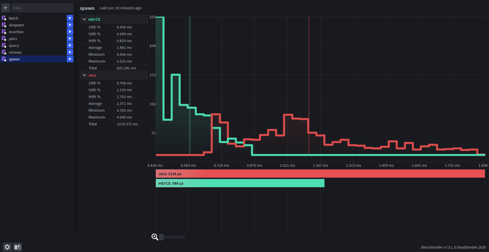
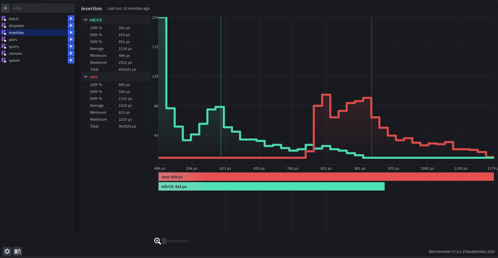
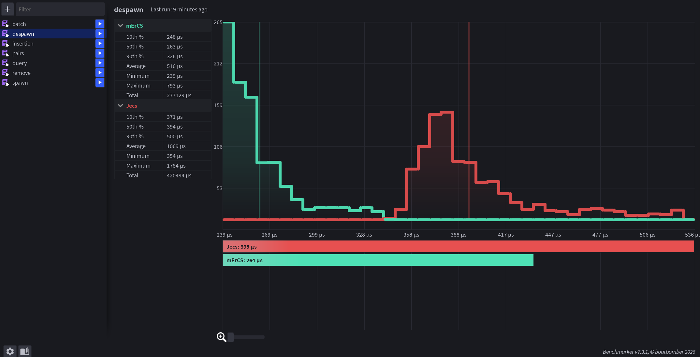
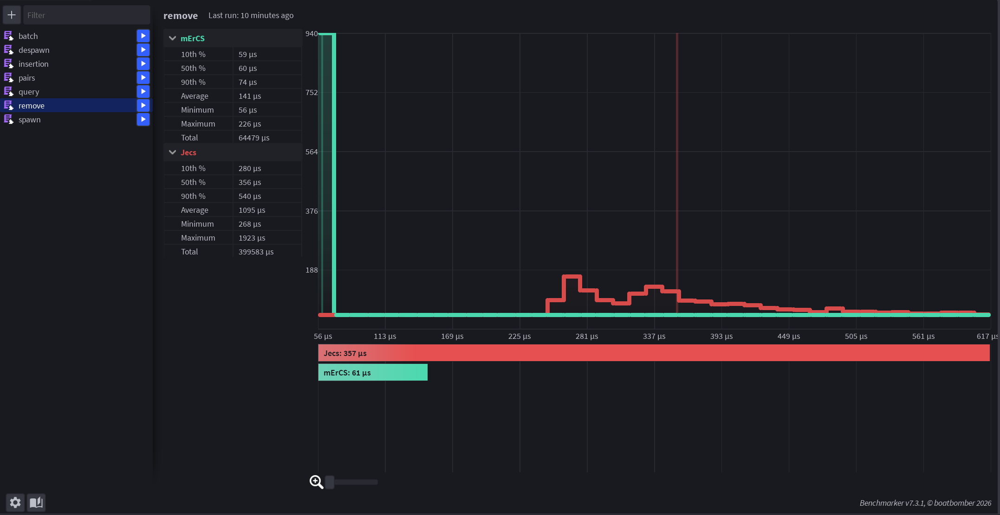
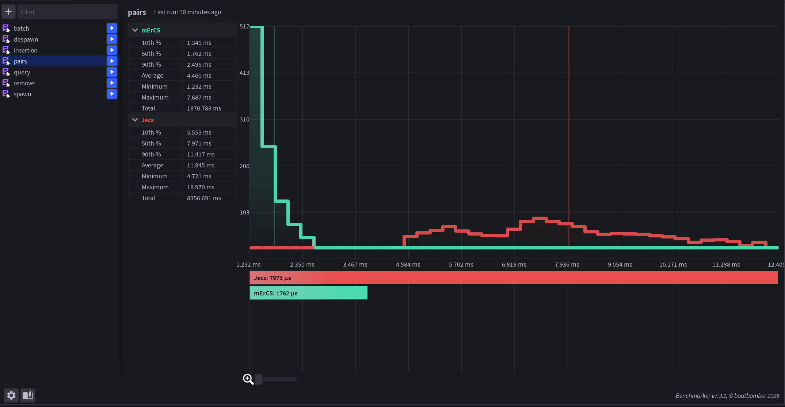
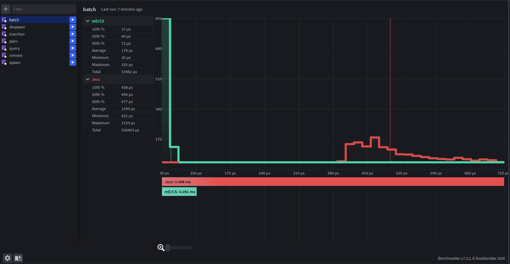
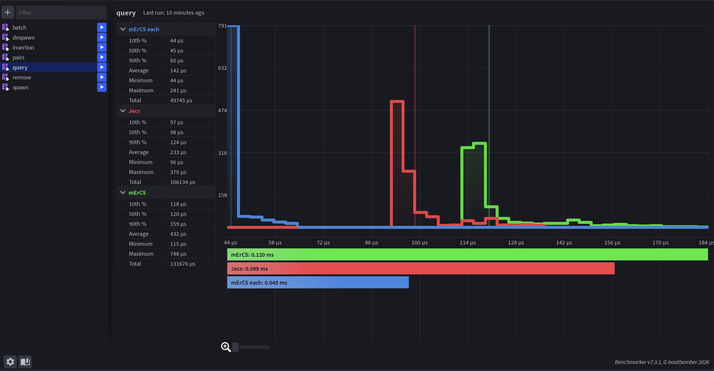

# mErCS and jecs

How mErCS differs from [jecs](https://github.com/Ukendio/jecs) 0.11: the design, the
behaviour, the numbers, and how to move code over.

## Contents

- [Design](#design)
- [Compatibility](#compatibility)
- [Differences in behaviour](#differences-in-behaviour)
- [Beyond jecs](#beyond-jecs)
- [Performance](#performance)
- [Migrating from jecs](#migrating-from-jecs)

## Design

An archetype ECS (jecs, flecs) stores the entities with the same set of components together.
That makes iteration fast, but every add or remove moves the entity to another archetype and
copies all its columns, every new combination of components creates an archetype that lives
until someone cleans it up, and relationships to many targets create an archetype per target.

mErCS keeps, for every component, tag or pair, a bitset of the entities that have it,
and the values in pages indexed by the entity slot (the model of the C# library
[StaticEcs](https://github.com/Felid-Force-Studios/StaticEcs), adapted to Luau). A query ANDs
the bitsets 32 entities at a time and walks the set bits.

| | jecs 0.11 | mErCS |
|---|---|---|
| add / remove a component | moves the entity, copies all its columns: O(components) | sets a bit and a value: O(1) |
| new combination of components | creates an archetype (kept until `world:cleanup()`) | nothing to create |
| pair with many targets | an archetype per target | one small record per pair, freed with its target |
| components per world | 256 via `world:component()` | no limit |
| ids per `get` / `has` call | 4 | 8, any number with `get_list` / `has_all` |
| memory per entity with 4 components | 320 B | 130 B |
| deep hierarchies | the cascade recurses: stack overflow at about 6000 levels | any depth (past 100 levels the rest is queued) |

## Compatibility

The API follows jecs: worlds, entities, components, tags, pairs, wildcards, `Exclusive`,
cleanup policies, hooks, signals, `Name`, pre-registration (`jecs.component()` /
`jecs.tag()` / `jecs.meta()`), the `ECS_*` helpers and the builtin ids.

The jecs test suite (`test/jecs_compat/`) runs against this library: 125 of 125 applicable
cases pass (its `bulk_insert` / `bulk_remove` come from a test shim, as loops of `set` /
`remove`). The cases that inspect jecs internals (archetype records, edges, the entity
visualiser) are not applicable and are listed in `test/jecs_compat/README.md`.

## Differences in behaviour

- No archetypes: `world:cleanup()`, `query:fini()` and the ids `ArchetypeCreate` /
  `ArchetypeDelete` do not exist (there is nothing for them to do), hooks do not get an
  `oldarchetype` argument.
- The jecs helpers `World.new`, `w`, `bulk_insert` / `bulk_remove`, `new` / `new_w_id` /
  `new_low_id`, `query:iter()` and `is_tag` are not provided: they would only repeat native
  calls (see [Migrating from jecs](#migrating-from-jecs)).
- jecs internals (`query:archetypes()`, `world.entity_index`, `entity_index_try_get`) are
  not provided either; the [jabby adapter](../guide/README.md#introspection-and-jabby) gives the debugger what it reads.
- An uncached query can be iterated again (jecs drains it after the first loop).
- `get` / `has` take up to 8 ids positionally (jecs: 4).
- The iteration order is ascending by entity slot, not by archetype.
- Builtin ids after `Name` have other numbers: `Exclusive` is 268 (jecs: 270), `Disabled`
  (not in jecs) 269, `Rest` 270 (jecs: 271).
- The jecs observer addon (`modules/OB`) depends on archetypes and does not work; use hooks,
  signals or change tracking.
- Setting a hook after connecting signals keeps the signals (in jecs the hook replaces them),
  and `world:get(id, ecs.OnAdd)` returns the hook, not the signal dispatcher.
- A signal listener that disconnects itself while it runs does not make the next listener
  miss the event (in jecs it does).
- Changing the world during a loop: the current entity may be changed or deleted in both.
  jecs may visit an entity twice when others are removed from its archetype; here an entity
  deleted ahead of the loop may be returned once as a dead id with nil values.

## Beyond jecs

- `query:each(fn)` — a callback per match, 30–60 % faster than the for-in loop.
- `query:any(...)` — OR terms.
- Batch operations: `query:count`, `add_all`, `set_all`, `remove_all`, `delete_all`, and
  `world:remove_all(id)`.
- Change tracking by ticks: `world:track`, `world:tick`, the `:added` / `:changed` /
  `:removed` filters.
- `ecs.Disabled`: entities hidden from queries without removing their components.
- `world:ids(e)`, a debug world (`ecs.world(true)`), `query:spans()` with `world:column(id)`.

## Performance

Benchmarks in `bench/` with `luau` 0.703. The jecs numbers were measured with the fork
`dubalda/jecs` at commit `082ec88`, which differs from the Wally release 0.11.0 now used by
the repository only by `world:targets`. Ratio = mErCS / jecs time (lower is better);
interpreter (`-O2`, the Roblox client) / native (`-O2 --codegen`, the Roblox server).
[Roblox Studio: Benchmarker](#roblox-studio-benchmarker) shows the same comparison inside
Roblox Studio.

### A synthetic game frame

`bench/frame.luau`: 3000 units with 2 attachments each follow their parents, 60 projectiles
spawn and expire per frame, damage uses a one-frame tag, 5 % of the units switch AI state
tags; plain for-in loops, the same code for both libraries. Median frame time; the queries
are written inline in every frame, or created once and `:cached()` (the recommended jecs
style):

| | jecs | mErCS | ratio |
|---|---|---|---|
| interpreter, inline queries | 5.22 ms | 2.46 ms | 0.47× |
| interpreter, cached queries | 4.95 ms | 2.41 ms | 0.49× |
| native, inline queries | 4.58 ms | 1.62 ms | 0.35× |
| native, cached queries | 4.29 ms | 1.67 ms | 0.39× |

### A long session

`bench/leak.luau`: 5 of 200 enemies die and respawn every frame, 10 % of 500 units retarget
a living enemy through a pair `(Targeting, enemy)` and switch a state tag; interpreter. Heap
growth since the start and time per frame:

| frame | jecs | jecs + `world:cleanup()` every 600 frames | mErCS |
|---|---|---|---|
| 1000 | +3.6 MB, 0.19 ms | +3.6 MB, 0.20 ms | +0.4 MB, 0.08 ms |
| 3000 | +9.0 MB, 0.22 ms | +8.8 MB, 0.22 ms | +0.4 MB, 0.08 ms |
| 5000 | +15.4 MB, 0.22 ms | +15.7 MB, 0.23 ms | +0.4 MB, 0.08 ms |

The archetypes of dead targets stay in jecs (cleanup does not release them all); here nothing
accumulates.

### Single operations

`bench/run.luau`, 131 072 entities, minimum of 7 runs; ratios within ±10 % of 1.0 vary
between runs:

| Scenario | jecs, ns (interp. / native) | ratio (interp. / native) |
|---|---|---|
| create an entity | 180 / 159 | 0.20× / 0.15× |
| delete an entity with 4 components | 363 / 362 | 0.99× / 0.56× |
| add a first component / set an existing one / remove | 124 / 100, 66 / 53, 179 / 162 | 1.13× / 0.84×, 0.94× / 0.79×, 0.60× / 0.35× |
| add or remove when the entity has 5…40 components | 351…2730 / 297…2250 | 0.35…0.04× / 0.23…0.02× |
| tag add / remove / toggle on 10 % of entities per frame | 316 / 265, 323 / 290, 969 / 602 | 0.28× / 0.20×, 0.32× / 0.21×, 0.16× / 0.16× |
| `get` 1 / 2 / 4 ids | 58 / 54, 67 / 57, 82 / 64 | 0.81× / 0.70×, 0.90× / 0.70×, 1.02× / 0.79× |
| `has` 1 / 4 ids | 59 / 34, 68 / 43 | 0.81× / 0.87×, 1.24× / 0.93× |
| pair add / set an existing value / remove / `target` | 274 / 193, 76 / 65, 234 / 206, 165 / 147 | 0.87× / 0.72×, 0.94× / 0.72×, 0.75× / 0.45×, 0.41× / 0.33× |
| delete a target (1000 × 100 sources) / `ChildOf` cascade (per child) | 180 / 178, 294 / 301 | 0.70× / 0.39×, 1.04× / 0.67× |
| for-in, 4 values, per entity: 8192 / 16 / 1 entities per archetype | 44 / 34, 66 / 56, 246 / 155 | 1.06× / 0.96×, 0.99× / 0.67×, 0.28× / 0.27× |
| `query:each`, same worlds, against the jecs for-in | 44 / 34, 66 / 56, 246 / 155 | 0.68× / 0.47×, 0.65× / 0.47×, 0.19× / 0.16× |
| manual loop (`spans` / jecs archetypes): 8192 / 16 per archetype | 12 / 5, 46 / 30 | 1.08× / 1.10×, 0.58× / 0.32× |
| for-in with `without` (half excluded) / sparse match (1 %) | 32 / 28, 39 / 34 | 1.06× / 1.12×, 1.5–1.6× / 1.52× |
| `query:each` for the same, against the jecs for-in | 32 / 28, 39 / 34 | 0.61× / 0.42×, 0.92× / 0.82× |
| a small query created on every call (15 matches of 1000 entities) | 1230 / 1080 | 1.00× / 1.00× |
| query with 10 terms | 92 / 66 | 0.95× / 0.89× |
| first iteration of a new query with 2000 archetypes | 106 000 / 103 000 | 0.004× / 0.003× |
| spawn + despawn (10 components, 2 tags) / hierarchy of 1 + 5 | 3980 / 3690, 19 800 / 18 500 | 0.55× / 0.34×, 0.47× / 0.37× |
| per match of a query (half of the entities): add a tag / set a component / remove a component (batch operations against a jecs collect-and-change loop) | 278 / 257, 287 / 246, 276 / 261 | 0.10× / 0.04×, 0.21× / 0.08×, 0.12× / 0.04× |
| the same: delete the matches / count them | 434 / 406, 31 / 28 | 0.89× / 0.59×, 0.20× / 0.09× |

### Memory and garbage

Bytes kept per unit (mErCS vs jecs, the same in both modes): an empty entity 32 vs
240; an entity with 4 components 130 vs 320; with 10 components and 5 tags 234 vs 417; a
`ChildOf` child 456 vs 726; a unique tag per entity 945 vs 1630; 1000 components on 100
entities each, per add 162 vs 398; growth per hierarchy spawn/despawn cycle 0 vs 218.

Garbage per iteration of a 2-component query over 200 entities: an inline
`for ... in world:query(A, B)` allocates an 82-byte handle (jecs: 922 bytes); a stored query
allocates nothing (jecs cached: nothing).

### Roblox Studio: Benchmarker

The files of `bench/visual/` run in Roblox Studio with the Benchmarker plugin (v7.3.1): Edit
mode, native code (the library and jecs are `--!native`), 1000 calls of each function. The
table compares the medians (50th percentile); the "Average" of Benchmarker is the midpoint of
the minimum and the maximum, not the mean.

| File | What | jecs | mErCS | ratio |
|---|---|---|---|---|
| `spawn.bench.luau` | 1000 entities with 4 components | 1.116 ms | 0.589 ms | 0.53× |
| `insertion.bench.luau` | 8 components into 500 existing entities | 926 µs | 614 µs | 0.66× |
| `despawn.bench.luau` | delete 1000 entities with 4 components and a tag | 394 µs | 263 µs | 0.67× |
| `remove.bench.luau` | remove one of 5 components from 1000 entities | 356 µs | 60 µs | 0.17× |
| `pairs.bench.luau` | 100 parents with 10 `ChildOf` children that also target a parent through a relation, then the parents are deleted | 7.971 ms | 1.762 ms | 0.22× |
| `batch.bench.luau` | add and remove a tag on 1000 of 2000 entities: batch operations against a jecs collect-and-change loop | 496 µs | 49 µs | 0.10× |
| `query.bench.luau` | 10 passes of a 4-component query over 4096 entities: for-in / `query:each` | 98 µs | 120 µs / 45 µs | 1.22× / 0.46× |

### Where mErCS is still slower

- Interpreter: a for-in over dense data, adding a first component and `without` by 5–13 %
  (`each` is 30–40 % faster than the jecs loop); `has` with 4 ids (1.2–1.3×); a for-in over a
  sparse match (1.5×: the values of a sparse component sit in the hash part of their page;
  `each` is on par with jecs); adding pairs of one relation with many targets spread over
  the entities (1.4–1.8×: the presence words of each pair sit in a hash).
- Native: the sparse for-in (1.5×), `without` and the manual dense loop (1.1×).
- Roblox Studio (Benchmarker, native): the for-in of `query.bench.luau` (1.22×; `query:each`
  takes 0.46× of the jecs loop).

## Migrating from jecs

1. Point the jecs require at this module (`local jecs = require(path.to.mErCS)`) and
   change the jecs calls that do not exist here (the type checker points at them):

   | jecs | mErCS |
   |---|---|
   | `jecs.World.new()` | `jecs.world()` |
   | `jecs.w` | `jecs.Wildcard` |
   | `jecs.bulk_insert(world, e, ids, values)` | `world:set(e, ids[i], values[i])` for each id |
   | `jecs.bulk_remove(world, e, ids)` | `world:remove(e, id)` for each id |
   | `jecs.new(world)` | `world:entity()` |
   | `jecs.new_w_id(world, id)` | `world:entity()`, then `world:add(e, id)` |
   | `jecs.new_low_id(world)` | `world:entity()`: a low id is not faster here |
   | `for e, a in query:iter() do`, `local step = query:iter()` | `for e, a in query do` (or `query:each(fn)`) |
   | `jecs.is_tag(world, id)` | `not world:has(id, jecs.Component)` (for a pair: neither element has it) |
   | `jecs.entity_index_try_get(world.entity_index, e)` | `world:contains(e)`; the ids of `e`: `world:ids(e)` |
   | `world:cleanup()`, `query:fini()` | delete the call: there is nothing to release |
   | `jecs.ArchetypeCreate`, `jecs.ArchetypeDelete` | delete: there are no archetypes |

   jabby needs the [adapter](../guide/README.md#introspection-and-jabby) instead of the plain module.

   Then run the game: the world API, pairs, wildcards, hooks, signals, cleanup policies,
   `Name`, `jecs.component()` / `jecs.tag()` / `jecs.meta()` and the `ECS_*` helpers keep their
   meaning. A debug world, `ecs.world(true)`, raises errors for dead entities and ids on
   every change while you migrate.
2. Rewrite what reads archetypes: loops over `query:archetypes()` with `columns` /
   `columns_map` become `query:each(fn)` (or `query:spans()` with `world:column(id)` for the
   hottest loops); hooks that use `oldarchetype` read the entity with `world:get` /
   `world:has`.
3. Remove most `:cached()` calls: shared queries are cached already (see
   [Coming from jecs](../guide/README.md#coming-from-jecs)). Replace the observer addon with signals,
   hooks or `world:track` with the `:added` / `:changed` / `:removed` filters.
4. Replace "collect the matches, then change them" loops with batch operations
   (`query:add_all`, `set_all`, `remove_all`, `delete_all`, `count`), and state flags stored
   as components with tags (`Disabled` hides entities from queries without removing
   anything).
5. Code that depends on the iteration order of archetypes, or on the numbers of builtin ids
   after `Name` (`jecs.Rest` is 270 here), needs a look (see the differences above).
